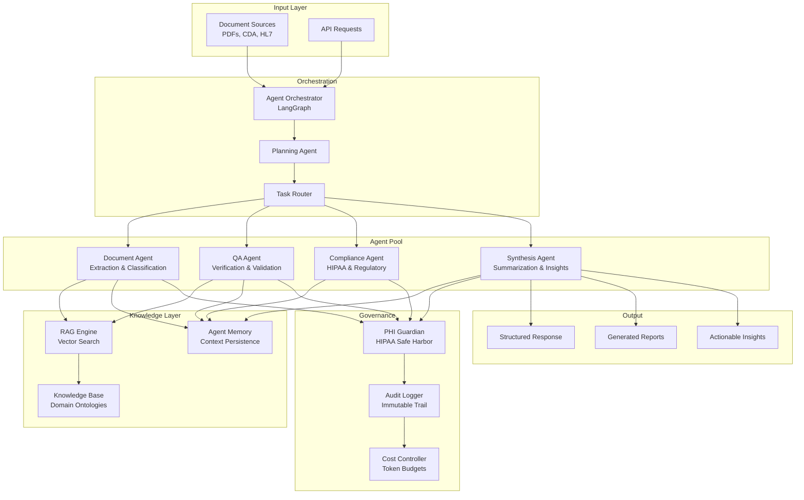

# CoCo Healthcare Intelligence

[](https://github.com/cmangun/coco-healthcare-intelligence/actions/workflows/ci.yml)
[](https://github.com/cmangun/coco-healthcare-intelligence/actions/workflows/codeql.yml)
[](https://www.python.org/downloads/)
[](https://opensource.org/licenses/MIT)
[](#compliance)

**Enterprise agentic AI system for healthcare document intelligence with multi-agent orchestration, HIPAA compliance, and full audit capabilities.**

*Inspired by production deployments in pharmaceutical R&D and regulatory affairs.*

## 🎯 Business Impact

| Metric | Improvement | How |
|--------|-------------|-----|
| Document processing time | **90% reduction** | Agentic parallel processing |
| Regulatory review cycles | **35% faster** | AI-assisted compliance checks |
| Data extraction accuracy | **95% F1** | Multi-agent verification |
| Audit preparation | **75% time saved** | Automated trail generation |

---

## 🏗️ Architecture



---

## ✨ Key Features

### 🤖 Multi-Agent Architecture
- **Document Agent**: Intelligent extraction and classification
- **QA Agent**: Cross-reference verification
- **Compliance Agent**: Regulatory requirement checking
- **Synthesis Agent**: Insight generation and summarization
- Configurable agent workflows via LangGraph

### 📄 Document Intelligence
- Multi-format support (PDF, DOCX, HL7, CDA, FHIR)
- Table and figure extraction
- Cross-document entity resolution
- Version diff and change tracking

### 🛡️ Enterprise Compliance
- HIPAA Safe Harbor PHI detection
- FDA 21 CFR Part 11 audit trails
- SOC 2 Type II controls
- GxP validation support

### ⚡ Production Features
- Async processing with task queues
- Horizontal scaling support
- Cost attribution and budgeting
- Real-time streaming responses

---

## 🚀 Quick Start

### Prerequisites
- Python 3.11+
- Redis (for task queue)
- PostgreSQL (for persistence)

### Installation

```bash
# Clone repository
git clone https://github.com/cmangun/coco-healthcare-intelligence.git
cd coco-healthcare-intelligence

# Create virtual environment
python -m venv venv
source venv/bin/activate

# Install dependencies
pip install -e ".[dev]"

# Set environment variables
cp .env.example .env
# Edit .env with your API keys
```

### Run the System

```bash
# Start API server
uvicorn src.api.main:app --reload --port 8002

# Start worker (separate terminal)
celery -A src.workers worker --loglevel=info
```

---

## 📖 Usage Examples

### Process Documents with Agents

```python
from src.orchestrator import AgentOrchestrator
from src.agents import DocumentAgent, QAAgent, ComplianceAgent

# Initialize orchestrator
orchestrator = AgentOrchestrator(
    agents=[DocumentAgent(), QAAgent(), ComplianceAgent()],
    llm_provider="openai",
    model="gpt-4-turbo"
)

# Process a document
result = await orchestrator.process(
    document_path="clinical_trial_protocol.pdf",
    task="Extract all endpoints and validate against ICH E9 guidelines",
    output_format="structured"
)

print(result.extracted_data)
print(result.compliance_status)
print(result.audit_trail)
```

### Agentic Document Q&A

```python
from src.agents import CoCoAgent

agent = CoCoAgent()

# Multi-turn conversation with document context
response = await agent.chat(
    message="What are the primary endpoints in Section 6.2?",
    documents=["protocol_v2.pdf"],
    conversation_id="session-123"
)

# Agent remembers context for follow-ups
follow_up = await agent.chat(
    message="Are these endpoints consistent with the SAP?",
    documents=["protocol_v2.pdf", "sap_v1.pdf"],
    conversation_id="session-123"
)
```

### Compliance Verification

```python
from src.agents import ComplianceAgent

compliance = ComplianceAgent()

# Check document against regulatory requirements
report = await compliance.verify(
    document="submission_package.pdf",
    regulations=["21_CFR_312", "ICH_E6_R2"],
    output_report=True
)

for finding in report.findings:
    print(f"{finding.severity}: {finding.description}")
    print(f"  Section: {finding.section}")
    print(f"  Recommendation: {finding.recommendation}")
```

---

## 📁 Project Structure

```
coco-healthcare-intelligence/
├── src/
│   ├── api/
│   │   └── main.py              # FastAPI application
│   ├── orchestrator/
│   │   ├── orchestrator.py      # Agent coordination
│   │   └── planner.py           # Task planning
│   ├── agents/
│   │   ├── base.py              # Base agent class
│   │   ├── document_agent.py    # Document processing
│   │   ├── qa_agent.py          # Quality assurance
│   │   ├── compliance_agent.py  # Regulatory compliance
│   │   └── synthesis_agent.py   # Insight generation
│   ├── rag/
│   │   └── retriever.py         # Vector search
│   ├── governance/
│   │   ├── phi_guardian.py      # PHI protection
│   │   └── audit_logger.py      # Audit trail
│   └── workers/
│       └── tasks.py             # Async task definitions
├── tests/
├── configs/
│   └── agent_configs.yaml       # Agent configurations
└── pyproject.toml
```

---

## 🧪 Testing

```bash
# Run all tests
pytest -v

# Run agent tests
pytest tests/test_agents.py -v

# Run with coverage
pytest --cov=src --cov-report=html
```

---

## 🤝 Contributing

See [CONTRIBUTING.md](CONTRIBUTING.md) for guidelines.

---

## 📜 License

MIT License - see [LICENSE](LICENSE) for details.

---

## 👤 Author

**Christopher Mangun** - Forward Deployed Engineer  
- GitHub: [@cmangun](https://github.com/cmangun)
- Website: [healthcare-ai-consultant.com](https://healthcare-ai-consultant.com)

---

## 🔗 Related Projects

- [healthcare-rag-platform](https://github.com/cmangun/healthcare-rag-platform) - HIPAA-compliant RAG
- [clinical-nlp-pipeline](https://github.com/cmangun/clinical-nlp-pipeline) - Medical NLP processing
- [agentic-workflow-engine](https://github.com/cmangun/agentic-workflow-engine) - Workflow orchestration
